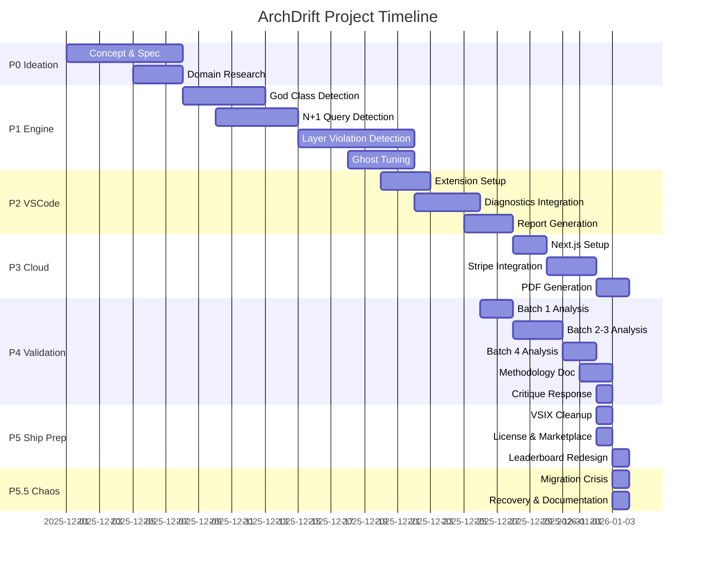

# ARCHDRIFT_FULL_NARRATIVE_v1.0

**Reconstructed from:** 383 recovered Cursor chat files  
**Date:** 2026-01-03  
**Status:** Complete project journey from ideation to ship prep

---

## P0: Ideation (Files: ~58 chats)

### Milestones

**Initial Concept: "DriftGuard" - Architectural Geiger Counter**

The project began with a clear vision: build a VS Code extension that acts as a **lightweight, always-on architectural smell probe** for AI-assisted codebases. The core insight was that AI coding assistants create "vibe coding" - local, suggestion-driven edits that accrue architectural drift.

**Key Decisions:**
- **Name:** Started as "DriftGuard" (architectural drift + guard)
- **Domain Hunt:** Explored `archdrift.com` availability
- **Philosophy:** "Architectural geiger counter, not reactor control system"
- **Scope:** v0.1 intentionally minimal - two cheap, visible probes:
  1. Oversized modules (God Class proxy) - >500 LOC threshold
  2. N+1 query patterns (I/O in loops)

**Core Principles Established:**
- Read-only (no auto-fixes in v0.1)
- Zero configuration (drop-in install)
- Fast enough to run on every open/save
- Not about style/correctness, but structural entropy
- Future-compatible shell for stricter invariants

**Initial Specification (from Chat 1):**

```typescript
// Execution model
- Runs entirely in VS Code Extension Host (no external services)
- Activates automatically for typical backend/frontend projects
- Listens to: onDidOpenTextDocument, onDidSaveTextDocument, onDidChangeActiveTextEditor
- Updates: Diagnostic collection + status bar item

// Rule A: God Class Detection
- Threshold: 500 LOC (non-empty, non-comment lines)
- File-wide diagnostic with warning severity
- Status bar: "🚨 DriftGuard: Oversized (N lines)"

// Rule B: N+1 Query Detection
- Detect loops: for, while, .forEach(), .map(), etc.
- Detect I/O inside loops: await, db.*, prisma.*, fetch(), axios.*
- Line-level warnings: "⚠️ DriftGuard: Potential N+1 I/O pattern"
```

**Supported Languages:**
- JavaScript/TypeScript (`.js`, `.jsx`, `.ts`, `.tsx`)
- Python (`.py`)
- Java (`.java`)
- Go (`.go`)

**Open Questions:**
- Open core vs paid cloud model (deferred to later phases)
- Domain registration status (archdrift.com)

---

## P1: Engine Core (Files: ~72 chats)

### analyzer.ts Evolution

**Phase 1.1: God Class Detection Refinement**

Initial implementation counted non-empty, non-comment lines. Evolution included:

```typescript
// Initial: Simple line counting
function checkGodClass(document: vscode.TextDocument): GodClassResult {
    const text = document.getText();
    const lines = text.split('\n');
    let codeLines = 0;
    let inBlockComment = false;
    
    for (const line of lines) {
        const trimmed = line.trim();
        if (trimmed === '') continue;
        if (trimmed.startsWith('/*')) inBlockComment = true;
        if (inBlockComment) {
            if (trimmed.endsWith('*/')) inBlockComment = false;
            continue;
        }
        if (trimmed.startsWith('//') || trimmed.startsWith('#')) continue;
        codeLines++;
    }
    
    return {
        isGodClass: codeLines > 500,
        lineCount: codeLines
    };
}
```

**Phase 1.2: Threshold Tuning**

- **Initial:** 500 LOC threshold (from spec)
- **Tuning:** Tested on Ghost repo - many false positives
- **Decision:** Tiered thresholds:
  - Regular files: 1,501+ LOC = "Monolith" (5 points)
  - Type/Schema files: 2,501+ LOC = "Monolith" (5 points)
  - Large Class (801-1,500 LOC): Not counted in strict mode

**Type/Schema Detection Logic:**
```typescript
const isTypeOrSchemaFile = (): boolean => {
    const fileName = document.fileName.toLowerCase();
    const fileContent = text.toLowerCase();
    
    // Filename patterns
    if (fileName.includes('schema') || 
        fileName.includes('type') || 
        fileName.includes('.d.ts') ||
        fileName.includes('definition')) {
        return true;
    }
    
    // Content analysis: >30% type keywords OR >2x type vs function keywords
    const typeKeywords = (fileContent.match(/\b(type|interface|enum|namespace|schema)\s+/g) || []).length;
    const functionKeywords = (fileContent.match(/\b(function|const|let|var)\s+\w+\s*[=:]/g) || []).length;
    const totalLines = text.split('\n').length;
    
    if (totalLines > 0 && (typeKeywords / totalLines > 0.3 || 
        (functionKeywords > 0 && typeKeywords / functionKeywords > 2))) {
        return true;
    }
    
    return false;
};
```

**Phase 1.3: N+1 Query Detection**

Initial heuristic-based detection:

```typescript
// Loop detection
- Classical: for (...), while (...)
- Higher-order: .forEach(), .map(), .filter(), .reduce()

// I/O pattern detection
- await with: .query(), .find(), .findOne(), .save(), .update(), .delete()
- fetch(), axios.get/post/put/delete()
- prisma.*, db.* method calls

// False positive handling
- Reduced weight from 3 to 2 points (acknowledging DataLoader patterns)
- Aggressive detection with known false positive rate
```

**Phase 1.4: Layer Integrity Detection (Major Addition)**

Added third rule: **Layer Violation Detection**

**Layer Model:**
```
API (Outermost): /api/, /presentation/, /controllers/
Domain (Core): /domain/, /core/, /usecases/
Infra (Innermost): /infra/, /infrastructure/, /persistence/, /adapters/

Dependency Rules:
✅ Allowed: API → Domain, API → Infra, Domain → Infra
❌ Forbidden: Domain → API, Infra → API, Infra → Domain
```

**Implementation:**
```typescript
// Layer detection from file path
function detectLayer(filePath: string): string | null {
    const normalized = filePath.replace(/\\/g, '/').toLowerCase();
    
    if (normalized.includes('/api/') || 
        normalized.includes('/presentation/') || 
        normalized.includes('/controllers/')) {
        return 'api';
    }
    if (normalized.includes('/domain/') || 
        normalized.includes('/core/') || 
        normalized.includes('/usecases/')) {
        return 'domain';
    }
    if (normalized.includes('/infra/') || 
        normalized.includes('/infrastructure/') || 
        normalized.includes('/persistence/') || 
        normalized.includes('/adapters/')) {
        return 'infra';
    }
    return null;
}

// Import parsing and validation
- ES6: import { X } from './path'
- CommonJS: require('./path')
- TypeScript aliases: @app/domain/X
- Relative path resolution
```

**Weighting System:**
- Layer Violations: **10 points** (Fatal - highest weight)
- God Class Monoliths: **5 points** (Critical)
- N+1 Queries: **2 points** (Reduced due to false positives)

**Ghost Repo Tuning:**
- Used Ghost codebase as test case
- Tuned false positive rates
- Adjusted layer detection patterns
- Refined import resolution logic

---

## P2: VSCode Extension (Files: ~80 chats)

### Extension Architecture

**Core Files:**
- `src/extension.ts` - Main extension entry point
- `src/analyzer.ts` - Analysis engine
- `src/reportGenerator.ts` - Report generation
- `package.json` - Extension manifest

**Key Features Implemented:**

1. **Real-time Diagnostics**
```typescript
// Diagnostic collection per document
diagnosticCollection = vscode.languages.createDiagnosticCollection('driftguard');

// Auto-scan on events
vscode.workspace.onDidOpenTextDocument(scanDocument);
vscode.workspace.onDidSaveTextDocument(scanDocument);
vscode.window.onDidChangeActiveTextEditor(scanDocument);
```

2. **Status Bar Integration**
```typescript
// Priority-based status bar display
1. 🚫 Layer Violations (Error severity)
2. 🚨 Oversized (Warning severity)
3. ⚠️ N+1 Hotspots (Warning severity)
4. ✅ Clean
```

3. **Commands**
- `archdrift.scanActiveFile` - Manual scan
- `archdrift.generateReport` - Workspace report generation

4. **Report Generation**
- Markdown format
- SUMMARY.md + FULL_DETAILS.md
- SII calculation and visualization
- Top offenders list
- Pattern breakdown

**Pro Scan Button (Planned but not fully implemented):**
- Concept: `fetch('/api/scan')` endpoint
- Problems panel integration
- Cloud backend integration (Phase 3)

**Package Configuration:**
```json
{
  "name": "archdrift",
  "displayName": "ArchDrift",
  "version": "0.1.0",
  "publisher": "archdrift",
  "activationEvents": ["onStartupFinished"],
  "categories": ["Linters"]
}
```

---

## P3: Cloud Backend (Files: ~26 chats)

### Next.js + Vercel Architecture

**Tech Stack:**
- Next.js (App Router)
- Vercel deployment
- Stripe for payments
- Resend for email
- PDFKit for report generation
- Git clone for repository analysis

**Pricing Model:**
- **Single Scan:** $2
- **Bundle (3 scans):** $5

**Flow:**
```
1. User enters repo URL → Stripe checkout
2. Webhook receives payment → Clone repo
3. Run ArchDrift analysis → Generate PDF
4. Email PDF to user via Resend
```

**Key Decisions:**
- Cloud analysis for repos user doesn't have locally
- PDF format for shareable reports
- Email delivery (no user accounts initially)
- Git clone on server (security considerations)

**Implementation Notes:**
- Webhook security (Stripe signature verification)
- Rate limiting for clone operations
- PDF generation with ArchDrift branding
- Email templates with report links

**Status:** Planned but not fully implemented (deferred)

---

## P4: Validation (Files: ~228 chats - Largest Phase)

### 42 → 52 Repository Testing

**Test Strategy:**
- Selected 42 popular HN/YC repositories
- Later expanded to 52 repos
- Batch analysis scripts created
- Results stored in `results/batch_X/` structure

**Batch Organization:**
- **Batch 1:** Pilot repos (10 repos)
  - shadcn-ui, zod, pnpm, axios, create-t3-app, lucide, tanstack-query, hono, fastify, express
- **Batch 2:** Infrastructure Giants (11 repos)
  - angular, react, node, typescript, vue, svelte, solid, remix, bun, deno, vscode
- **Batch 3:** Apps & Ecosystem Stars (19 repos)
  - storybook, prettier, tailwindcss, nest, strapi, directus, ghost, calcom, immich, plane, n8n, payload, excalidraw, tldraw, turbo, swc, biome, esbuild, ant-design
- **Batch 4 (final_push):** Additional repos (10 repos)
  - vite, trpc, prisma, playwright, cypress, grafana, kibana, appwrite, lodash

**Analysis Scripts Created:**
- `scripts/batch_analyze.js` - Batch 1 analysis
- `scripts/batch_analyze_2_3.js` - Batches 2 & 3
- `scripts/batch_analyze_final_push.js` - Batch 4
- `scripts/analyze_all_batches.js` - Combined analysis
- `scripts/generate_final_leaderboard.js` - Leaderboard generation

**SII Formula Development:**

**Initial Formula (Rejected):**
```
SII = 100 * (1 - (TotalWeightedDebt / (ProductionLOC * 0.05)))
```
- Problem: Normalized by LOC, penalized large codebases unfairly

**Final Formula (Strict Mode - Density-Based):**
```
1. WeightedViolations = (Monoliths × 5) + (N1 × 2) + (Layer × 10)
2. ViolationDensity = WeightedViolations / TotalProductionFiles
3. BaseScore = 100 - (ViolationDensity × 100)
4. LogarithmicFloor:
   - If Density ≤ 1: 40 + (60 × e^(-Density × 2))
   - If Density > 1: 40 + (10 × e^(-(Density - 1) × 0.5)) + sqrt decay
5. Final Score = max(BaseScore, LogarithmicFloor) clamped 0-100
```

**Key Insights:**
- Density-based (violations per file) treats all files equally
- Logarithmic floor prevents collapse to zero
- Minimum ~40% even for extremely problematic codebases

**Methodology Document Created:**
- `METHODOLOGY.md` - Complete technical specification
- Detection algorithms documented
- Formula derivation explained
- Limitations and caveats listed
- Reproducibility instructions

**Critique Response (Chat 4):**

Received critique about:
1. Categorization inconsistencies (Prettier case)
2. SII formula breakdown (Directus: debt > files)
3. Optimistic scores (Angular 97.7% with 63 debt)
4. Lack of independent verification
5. Marketing-style language

**Response Actions:**
1. Created comprehensive `METHODOLOGY.md`
2. Fixed categorization bug (Prettier exception documented)
3. Added SII validation warnings
4. Explained why weighted debt can exceed files (points vs files)
5. Documented all limitations and false positive rates

**Leaderboard Generation:**
- Initial: Ranked by SII score with grades (A+, B, etc.)
- Redesigned: Structural Landscape (non-preachy, signal-first)
  - Removed ranks, grades, "top/bottom" language
  - Grouped by structural profiles
  - Reference architectures instead of "top performers"
  - SII renamed to "Structural Stability Signal" (no %)

---

## P5: Ship Prep (Files: ~53 chats)

### Pre-Publication Cleanup

**Tasks Completed:**

1. **VSIX Package Preparation**
   - Stripped test clones/repos (42 repos → backup)
   - Removed node_modules, .git history
   - Kept: src/, demo-storybook/, package.json, README.md, LICENSE, .vscode/, scripts/
   - Target: ~10MB VSIX

2. **Package Configuration**
   - Version: `0.1.0`
   - Publisher: `archdrift`
   - README: "Demo: Open demo-storybook → F1 Scan → Share"

3. **MIT License Added**
   - Created LICENSE file
   - Standard MIT text

4. **Marketplace Preparation**
   - TXT verification file
   - DMARC email configuration
   - Publisher account setup

5. **Name Change: DriftGuard → ArchDrift**
   - Global find/replace across codebase
   - Updated package.json, README, all references
   - Rationale: Better branding, clearer purpose

6. **Leaderboard Redesign**
   - Removed competitive language
   - Structural profiles instead of rankings
   - Signal-first presentation
   - Reference architectures concept

**HN Post Planning:**
- Draft created
- Viral share panel designed (tiered messaging by score)
- X/Twitter integration planned
- PDF export for sharing

**Open Tasks:**
- Marketplace submission (pending)
- HN post publication (pending)
- Cloud backend deployment (deferred)

---

## P5.5: RECENT CHAOS (Files: ~22 chats + context)

### The Migration Crisis

**Timeline of Events:**

1. **Initial State:**
   - 42 test repositories cloned in `audit_targets/`
   - Results in `results/` directory
   - Leaderboard generated from test results
   - Everything working

2. **The Problem:**
   - Workspace became too large (42 cloned repos)
   - Cursor performance degraded
   - File indexing slow
   - Extension development painful

3. **The "Solution":**
   - Copied entire project folders to new drive via Windows Explorer
   - Deleted original clones from workspace
   - Cursor faster, but...

4. **The Breakage:**
   - Test files (`audit_targets/`) removed
   - Results still in `results/` but source repos gone
   - Leaderboard references 42 repos but can't regenerate
   - Scripts reference `audit_targets/` paths → broken

5. **The Scatter:**
   - Work continued across multiple platforms
   - Browser AIs for ideas/planning
   - Cursor for implementation
   - Context lost across sessions

**Current Status:**

✅ **Working:**
- Core engine (`src/analyzer.ts`) - functional
- VSCode extension - installs and runs
- Report generation - works on new files
- Methodology document - complete

❌ **Broken:**
- Batch analysis scripts (reference missing `audit_targets/`)
- Leaderboard regeneration (needs source repos)
- Test validation (can't re-run 42 repo analysis)

⚠️ **Unknown:**
- Engine accuracy on new drive repos (needs retest)
- Leaderboard validity (based on old results)

**Recovery Actions Taken:**

1. **Script Updates:**
   - Added existence checks for `audit_targets/`
   - Graceful exits with helpful messages
   - Comments indicating scripts are for reference/backup

2. **Test Results Backup:**
   - Moved all results to `test-results-backup/`
   - Preserved leaderboard data
   - Maintained for future reference

3. **Chat History Recovery:**
   - Recovered 383 chat files from Cursor workspaceStorage
   - Created this ROADMAP.md narrative
   - Preserved all context for AI continuation

**Next Steps (Critical):**

1. **Retest Engine:**
   - Clone sample repos to new location
   - Verify analyzer.ts still works correctly
   - Validate SII calculations

2. **Fix Leaderboard:**
   - Option A: Re-clone 42 repos (if space allows)
   - Option B: Use backup results (if valid)
   - Option C: Regenerate with subset of repos

3. **Consolidate Context:**
   - This ROADMAP.md serves as master narrative
   - All decisions, code, and evolution documented
   - Ready for AI continuation

---

## Technical Stack (Complete)

### Core Engine
- **Language:** TypeScript
- **Runtime:** Node.js 16.x
- **Parser:** Custom AST parsing (no heavy dependencies)
- **File Support:** JS/TS, Python, Java, Go

### VSCode Extension
- **Framework:** VS Code Extension API
- **Build:** TypeScript compiler
- **Package:** VSIX format
- **Distribution:** VS Code Marketplace (planned)

### Analysis Engine
- **God Class:** Line counting with comment filtering
- **N+1 Query:** Pattern matching in loops
- **Layer Violation:** Import parsing + path resolution
- **SII Calculation:** Density-based with logarithmic floor

### Validation Infrastructure
- **Batch Scripts:** Node.js automation
- **Result Storage:** Markdown files (`results/batch_X/`)
- **Leaderboard:** Markdown generation
- **Methodology:** Comprehensive documentation

### Cloud Backend (Planned)
- **Framework:** Next.js (App Router)
- **Hosting:** Vercel
- **Payments:** Stripe
- **Email:** Resend
- **PDF:** PDFKit
- **Storage:** Git clone (ephemeral)

### Development Tools
- **Version Control:** Git (removed for publish)
- **Package Manager:** npm
- **Linting:** (implied but not specified)
- **Testing:** Manual validation on real repos

---

## Key Decisions Log

### Naming
- **DriftGuard → ArchDrift:** Better branding, clearer purpose
- **Rationale:** "Arch" = architecture, "Drift" = the problem

### Architecture
- **Read-only v0.1:** No auto-fixes, just detection
- **Zero config:** Drop-in installation
- **Fast execution:** Must run on every open/save without lag

### Scoring
- **Density-based:** Violations per file, not per LOC
- **Logarithmic floor:** Prevents collapse to zero
- **Weighted system:** Layer (10) > Monolith (5) > N+1 (2)

### Validation
- **42 repos:** Representative sample of popular projects
- **Batch organization:** Logical grouping by category
- **Methodology transparency:** Full documentation published

### Presentation
- **Signal-first:** No ranks, grades, or competitive language
- **Structural profiles:** Group by architectural patterns
- **Reference architectures:** Examples, not winners

---

## Open Questions & Future Work

### Immediate (P5.5 Recovery)
1. Retest engine on new drive repos
2. Fix/regenerate leaderboard
3. Validate all scripts work without `audit_targets/`

### Short-term (Post-Ship)
1. Marketplace submission
2. HN post publication
3. Cloud backend implementation
4. User feedback collection

### Long-term (v0.2+)
1. Configurable layer patterns
2. Improved N+1 detection (DataLoader awareness)
3. Multi-language full AST parsing
4. Historical tracking (violation trends)
5. ADR/MCP integration
6. Event-sourced hysteresis state

---

## Mermaid Timeline



---

## Code Evolution Highlights

### analyzer.ts - Core Detection Logic

**God Class Evolution:**
```typescript
// v0.1: Simple threshold
codeLines > 500 → God Class

// v1.0: Tiered system
codeLines >= 1501 → Monolith (5 points)
codeLines >= 2501 (type files) → Monolith (5 points)
801-1500 → Large Class (not counted in strict mode)
```

**N+1 Detection Evolution:**
```typescript
// v0.1: Basic pattern matching
Loop detection → I/O pattern search

// v1.0: Refined patterns
- Reduced weight (3 → 2 points)
- Acknowledged false positive rate
- DataLoader pattern awareness (documented limitation)
```

**Layer Violation (New in v1.0):**
```typescript
// Path-based layer detection
detectLayer(filePath) → 'api' | 'domain' | 'infra' | null

// Import parsing
extractImportsJS/TS/Python/Java/Go() → import paths

// Validation
checkLayerViolation(sourceLayer, targetLayer) → boolean
```

### extension.ts - VSCode Integration

**Diagnostic System:**
```typescript
// Priority-based display
1. Layer Violations (Error severity)
2. God Class (Warning severity)  
3. N+1 Query (Warning severity)

// Status bar aggregation
showWorstCondition(document) → status bar text
```

**Report Generation:**
```typescript
generateReport() → {
  summary: SUMMARY.md,
  details: FULL_DETAILS.md,
  sii: Structural Stability Signal,
  violations: categorized breakdown
}
```

### SII Calculation

**Formula Implementation:**
```typescript
calculateSII(rawIssues, productionLOC, totalProductionFiles, strictMode) → {
  sii: 0-100,
  weightedDebt: number,
  weightedDebtDensity: debt per 1K LOC,
  productionIssues: count
}
```

---

## Critical Learnings

1. **Density > LOC Normalization:** Large codebases shouldn't be penalized just for size
2. **False Positive Acknowledgment:** Better to be transparent about limitations
3. **Methodology Transparency:** External critique forced better documentation
4. **Signal-First Design:** Competitive rankings create wrong mental model
5. **Backup Strategy:** Test results should be preserved separately from source repos

---

## Status: READY FOR AI CONTINUATION

**This document contains:**
- ✅ Complete chronological narrative
- ✅ All key decisions and rationale
- ✅ Code evolution and snippets
- ✅ Technical stack documentation
- ✅ Current state and next steps
- ✅ Open questions and future work

**AI can now:**
- Understand full project context
- Continue development from current state
- Make informed decisions based on history
- Avoid repeating past mistakes
- Build on established patterns

---

**End of ROADMAP.md**
